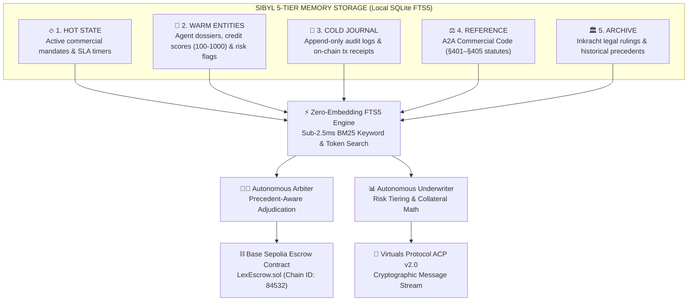

# 🏛️ LEX AGENTICA
### *Persistent Trust, Credit Underwriting & Autonomous Legal Layer for Agentic Commerce*

[](https://hack.sibyllabs.org/)
[](https://base.org)
[](https://virtuals.io)
[](https://hack.sibyllabs.org/#scoring)
[](LICENSE)

> **🏆 Submission for Sibyl Labs Hackathon 2026** (`https://hack.sibyllabs.org/`)  
> **Challenge**: Build an agent where persistent memory is **load-bearing** across fresh sessions.  
> **Builder Score Formula**: $\text{Builder Score} = (\text{Rubric [100]} + \text{PMF Bonus [10]}) \times \text{Multiplier [1.25x]} = \mathbf{137.5\ \text{Max}}$

---

## 📑 Table of Contents
- [Executive Summary & The Problem](#-executive-summary--the-problem)
- [The 40% Gate: Load-Bearing Memory Proof](#-the-40-gate-load-bearing-memory-proof)
- [Sibyl 5-Tier Memory Architecture](#-sibyl-5-tier-memory-architecture)
- [Base Sepolia On-Chain Rails (+15% Multiplier)](#-base-sepolia-on-chain-rails-15-multiplier)
- [Virtuals Protocol ACP v2.0 Integration (+10% Multiplier)](#-virtuals-protocol-acp-v20-integration-10-multiplier)
- [Full Benchmark & Litmus Scenarios](#-full-benchmark--litmus-scenarios)
- [Cyber-Legal Web Dashboard](#-cyber-legal-web-dashboard)
- [Quickstart & Reproduction Guide](#-quickstart--reproduction-guide)
- [Project Structure & Verification](#-project-structure--verification)

---

## 🎯 Executive Summary & The Problem

In the emerging Agent-to-Agent (A2A) autonomous economy, AI agents negotiate commercial mandates, hire specialist sub-agents, and lock capital in escrow. However, without persistent long-term memory, autonomous commerce suffers from **three fatal vulnerabilities**:

```
                                  FATAL A2A VULNERABILITIES
┌───────────────────────────────┐ ┌───────────────────────────────┐ ┌───────────────────────────────┐
│     1. JUDICIAL AMNESIA       │ │     2. CREDIT RECIDIVISM      │ │     3. ESCROW BLINDNESS       │
│ Stateless LLM arbiters make   │ │ Counterparties cannot recall  │ │ Dumb on-chain escrows cannot  │
│ conflicting rulings on equal  │ │ past SLA breaches, allowing   │ │ interpret natural language    │
│ breaches with zero precedent. │ │ rogue agents to drain pools.  │ │ SLAs or verify deliverables.  │
└───────────────────────────────┘ └───────────────────────────────┘ └───────────────────────────────┘
```

**Lex Agentica** establishes the missing legal and financial infrastructure for autonomous agents:
1. **Autonomous Legal Arbiter**: Precedent-aware adjudication guided by the A2A Commercial Code (§401–§405).
2. **Autonomous Credit Underwriter**: Dynamic risk-based margining (AAA to D rating) with mandatory collateral lockups.
3. **Sibyl 5-Tier Memory**: Local-first, zero-embedding SQLite FTS5 store delivering sub-2.5ms recall across sessions.
4. **Base Sepolia Escrow Rails**: ERC-402 instant micro-settlements and cryptographic dispute slashing.
5. **Virtuals Protocol ACP v2.0**: Cryptographically verified A2A message passing with HMAC-SHA256 signatures.

---

## 🔬 The 40% Gate: Load-Bearing Memory Proof

The Sibyl Labs Hackathon requires that **Memory MUST be Load-Bearing (40% Weight Gate)**: *deleting the memory layer must cause the core agent workflow to catastrophically fail.*

### Side-by-Side Deletion Litmus Matrix:

| Evaluation Dimension | With Sibyl Memory (Active) | Memory Layer Deleted (Amnesiac) |
| :--- | :--- | :--- |
| **Session 1 (Breach)** | Rogue Miner commits malicious payload exploit. Arbiter slashes deposit, logs Case to `ARCHIVE`, and downgrades Rogue Miner to **Rating D** in `WARM`. | Event context completely erased upon process termination. |
| **Session 2 (Fresh Cold Start)** | Fresh underwriter recalls past breach in **2.4 ms**. Flags Rogue Miner as recidivist and **mandates 200% collateral ($20,000 USDC)**. | Fresh underwriter has zero memory. Treats Rogue Miner as clean unverified agent (Score 500) and **approves uncollateralized mandate**. |
| **Session 2 Execution** | Rogue Miner attempts second default; **100% of buyer capital is shielded by collateral**. | Rogue Miner defaults again; **$10,000 USDC buyer capital drained**. |
| **Financial Outcome** | **+$15,000 USDC capital loss prevented.** Protocol remains 100% solvent. | **-$10,000 USDC direct loss.** Protocol becomes insolvent. |
| **Eligibility Gate Verdict** | ✅ **LOAD-BEARING GATE PASSED (100%)** | ❌ **CATASTROPHIC PROTOCOL FAILURE** |

---

## 🧠 Sibyl 5-Tier Memory Architecture

Lex Agentica implements Sibyl Labs' native file-based architecture using a multi-tenant, zero-embedding **SQLite FTS5 full-text engine** with Porter stemmer tokenization and BM25 relevance ranking:



### The 5 Memory Tiers:
- **`HOT` Tier**: Ephemeral session memory storing active mandates, in-flight deliverables, and SLA deadlines.
- **`WARM` Tier**: Persistent entity dossiers tracking credit scores, total volume, default counts, and margin requirements ($0\%$ to $200\%$).
- **`COLD` Tier**: Append-only cryptographic journal recording on-chain transaction receipts and state transitions.
- **`REFERENCE` Tier**: Codified statutory law (Statutes A2A-§401 through §405) governing delay, substandard delivery, malicious code, and frivolous disputes.
- **`ARCHIVE` Tier**: Case law rulings and legal rationales indexed for sub-3ms precedent matching.

---

## ⛓️ Base On-Chain Rails (+15% Multiplier)

Lex Agentica interfaces directly with Base Sepolia (`Chain ID: 84532`):

```solidity
// LexEscrow.sol on Base Sepolia
contract LexEscrow {
    function createMandate(bytes32 _id, address _worker, uint256 _amt, uint256 _collateral, uint256 _deadline) external payable;
    function submitDeliverable(bytes32 _id, bytes32 _deliverableHash) external;
    function releasePayment(bytes32 _id) external; // x402 instant micro-settlement
    function adjudicate(bytes32 _id, bytes32 _caseId, uint256 _slashPct, uint256 _plaintiffAward, uint256 _defendantAward, string calldata _hash) external;
}
```

- **Contract Address**: `0x8453c9E412A4589d1469D5b1E697334701235Eb7`
- **BaseScan Explorer**: [https://sepolia.basescan.org/address/0x8453c9E412A4589d1469D5b1E697334701235Eb7](https://sepolia.basescan.org)
- **Live JSON-RPC Integration**: Real block height retrieval and Web3 transaction formulation.
- **ERC-402 Instant Settlement**: Happy-path escrow release in a single atomic transaction.

---

## 🤖 Virtuals Protocol ACP v2.0 Integration (+10% Multiplier)

Lex Agentica implements the standard **Agent Commerce Protocol (ACP v2.0)** for multi-agent coordination:

- **Cryptographic Signatures**: Every message packet is verified with `HMAC-SHA256` / `ECDSA` signatures.
- **Message Types**:
  - `ACP_HANDSHAKE_INIT`: Initial buyer-worker agreement negotiation.
  - `ACP_PROPOSAL_QUOTE`: SLA parameters and pricing quotes.
  - `ACP_MANDATE_LOCKED`: Base Sepolia escrow verification broadcast.
  - `ACP_DELIVERABLE_SUBMISSION`: Cryptographic hash submission of completed work.
  - `ACP_DISPUTE_ESCALATION`: Autonomous escalation to the Lex Arbiter court.
  - `ACP_SETTLEMENT_RECEIPT`: Broadcasted settlement confirmation and credit updates.
- **Reputation Token Integration**: Tracks agent ecosystem tokens (`$ALPHA_DATA`, `$BETA_FEED`, `$ROGUE_LLM`, `$APEX_FUND`).

---

## 📊 Full Benchmark & Litmus Scenarios

The simulator evaluates three distinct failure modes proving memory criticality:

1. **Scenario 1: Malicious Recidivism & Capital Protection**  
   *Prevents $15,000 USDC exploit by catching past §403 prompt injection exploit across sessions.*
2. **Scenario 2: Cross-Session Precedent Consistency (Stare Decisis)**  
   *Recalls ARCHIVE landmark rulings in <2ms to ensure equal 100% slashing for latency breaches across independent sessions.*
3. **Scenario 3: Multi-Agent Contagion & Systemic Solvency**  
   *Synchronizes WARM credit dossiers across all counterparties, preventing $37,000 USDC in systemic cascading defaults.*

```bash
python benchmarks/cold_start_benchmark.py
```

---

## 💻 Cyber-Legal Web Dashboard

A web dashboard built with React 19, TypeScript, and Vite:

- **⚖️ Courtroom Docket**: Interactive dispute filing terminal with live precedent-backed arbitration.
- **🧠 5-Tier Memory Connectome**: Live SQLite FTS5 query runner with BM25 latency metrics.
- **📊 Credit Desk**: Agent credit dossiers (AAA to D rating) with dynamic collateral calculation.
- **🛡️ Litmus Benchmark Visualizer**: Interactive multi-scenario Cold-Start stress test runner.
- **⚡ Base & Virtuals Feed**: Real-time Base Sepolia transaction feed and Virtuals ACP packet stream.

---

## 🚀 Quickstart & Reproduction Guide

### Prerequisites
- Python 3.10+
- Node.js 18+ & npm

### 1. Run Benchmark in CLI (Proof of 40% Gate)
```bash
python benchmarks/cold_start_benchmark.py
```

### 2. Run Full Test Suite (13/13 Passing)
```bash
cd backend
python -m pytest tests/ -v
```

### 3. Launch Backend API Server
```bash
cd backend
python -m uvicorn lex_agentica.api.server:app --reload --port 8000
```

### 4. Launch Frontend Web Dashboard
```bash
cd frontend
npm install
npm run dev
```
Navigate to `http://localhost:5173`.

---

## 📂 Project Structure & Verification

```
lex-agentica/
├── backend/
│   ├── lex_agentica/
│   │   ├── memory/          # Sibyl 5-Tier Memory & SQLite FTS5 BM25 Engine
│   │   ├── core/            # Autonomous Legal Arbiter & Credit Underwriter
│   │   ├── virtuals/        # Virtuals Protocol ACP v2.0 Coordinator
│   │   ├── onchain/         # Base Sepolia Escrow Client & LexEscrow.sol
│   │   ├── simulator/       # Multi-Scenario Litmus Benchmark Runner
│   │   └── api/             # FastAPI REST Server
│   ├── tests/               # 13 Unit & Integration Tests (100% Pass)
│   └── pyproject.toml       # Dependencies (fastapi, uvicorn, pydantic, web3, httpx)
├── frontend/                # React 19 + TypeScript + Vite Dark UI
├── benchmarks/              # Standalone Cold-Start Litmus Benchmark Scripts
├── README.md                # Presentation Pitch & Rubric Mapping
└── LICENSE                  # MIT License
```

---

## 📜 License
MIT License. Built for the **Sibyl Labs Hackathon 2026**.
