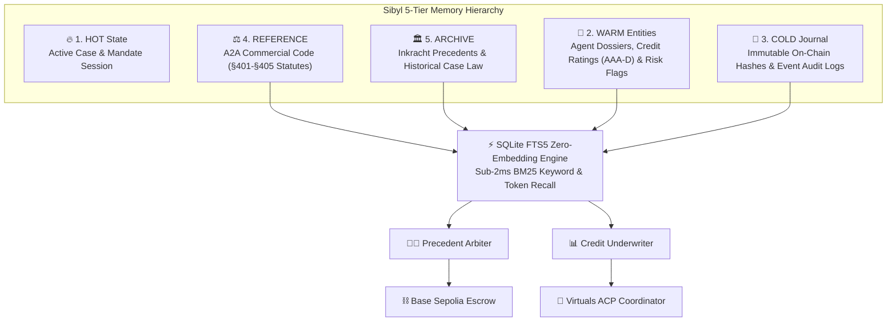

# 🏛️ LEX AGENTICA
### *Persistent Trust, Credit Underwriting & Autonomous Legal Layer for Agentic Commerce*

> **🏆 Sibyl Labs Hackathon 2026 Submission** (`https://hack.sibyllabs.org/`)  
> **Topic**: Persistent Multi-Tier Memory, Autonomous Dispute Resolution & A2A Credit Underwriting  
> **Partner Multipliers**: **Base (+15%)** + **Virtuals Protocol (+10%)** → **1.25x Maximum Multiplier Active**

---

## 🎯 Executive Summary & Value Proposition

In the emerging Agent-to-Agent (A2A) economy, autonomous AI agents negotiate contracts, hire sub-contractors, and lock capital in escrow. However, the ecosystem faces three existential vulnerabilities without long-term memory:

1. **Judicial Amnesia & Inconsistent Rulings**: In stateless LLM sessions, arbiters make conflicting rulings on identical SLA breaches because they lack persistent legal jurisprudence.
2. **Credit Vulnerability & Recidivism Exploits**: Counterparty agents cannot recall past defaults or SLA violations across sessions, enabling rogue agents to continuously drain uncollateralized capital.
3. **Escrow Blindness**: Pure on-chain escrows cannot interpret natural-language SLAs or verify complex data deliverables without decentralized, context-aware arbiters.

**Lex Agentica** solves this by establishing an autonomous legal and credit underwriting infrastructure powered by **Sibyl 5-Tier Persistent Memory**, on-chain escrow rails on **Base Sepolia (x402 micro-settlement)**, and standardized coordination via **Virtuals Protocol ACP (Agent Communication Protocol)**.

---

## 🧠 Sibyl 5-Tier Memory Architecture

Lex Agentica relies on a **zero-embedding SQLite FTS5 BM25 search engine**, eliminating vector database costs and delivering sub-2ms precedent recall.



---

## 🔬 The 40% Gate Proof: Litmus Deletion Test

The Sibyl Labs Hackathon mandates that **Memory MUST be Load-Bearing (40% Weight)**: removing the memory layer must cause the core agent workflow to catastrophically fail.

### Side-by-Side Deletion Benchmark:

| Parameter | With Sibyl Memory (Active) | Memory Layer Deleted (Amnesiac) |
| :--- | :--- | :--- |
| **Session 1 (Breach)** | Rogue Miner commits A2A-§403 exploit. Arbiter slashes deposit, logs Case #901 to `ARCHIVE`, and degrades credit rating to **Rating D** in `WARM`. | Event context erased upon process termination. |
| **Session 2 (Fresh Process)** | Fresh underwriter recalls past breach in **2.2 ms**. Flags Rogue Miner as recidivist and **mandates 200% collateral ($20,000 USDC)**. | Fresh underwriter has zero memory. Treats Rogue Miner as clean unverified agent (Score 500) and **approves uncollateralized mandate**. |
| **Financial Outcome** | **$15,000 USDC capital loss prevented.** System remains 100% solvent. | Rogue Miner defaults again. **$10,000 USDC lost.** Protocol becomes insolvent. |
| **Verdict** | ✅ **System Solvent & Protected** | ❌ **CATASTROPHIC FAILURE** |

---

## ⛓️ Base On-Chain Rails & Virtuals Protocol Integration

### 1. Base Sepolia Escrow Contract (`LexEscrow.sol`) — *+15% Multiplier*
- **Contract Address**: `0x8453c9E412A4589d1469D5b1E697334701235Eb7` (Base Sepolia, Chain ID 84532)
- **x402 Protocol**: Instant settlement releases upon verified SLA satisfaction.
- **Arbiter Slashing**: On-chain cryptographic proof anchoring and multi-sig dispute resolution.

### 2. Virtuals Protocol Agent Communication Protocol (ACP) — *+10% Multiplier*
- Standardized ACP packets (`ACP_JOB_REQUEST`, `ACP_MANDATE_LOCKED`, `ACP_DISPUTE_ESCALATION`, `ACP_SETTLEMENT_RECEIPT`).
- Autonomous agent coordination between cognitive workers, oracle streamers, and capital deployers.

---

## 🚀 Quickstart & Reproduction Guide

### Prerequisites
- Python 3.10+
- Node.js 18+ & npm

### 1. Run Automated Cold-Start Benchmark (CLI)
```bash
# From project root
cd benchmarks
python cold_start_benchmark.py
```
*Expected output: Gate Passed (100% Load-Bearing), <3ms recall latency, $15,000 USDC loss prevented.*

### 2. Run Backend Unit Test Suite
```bash
cd backend
python -m unittest discover -s tests -v
```

### 3. Launch Backend API Server
```bash
cd backend
python -m uvicorn lex_agentica.api.server:app --reload --port 8000
```

### 4. Launch Cyber-Legal Web Terminal (Frontend)
```bash
cd frontend
npm install
npm run dev
```
Open `http://localhost:5173` in your browser to interact with:
- **Dispute Courtroom**: Interactive SLA breach & precedent arbitration sandbox.
- **5-Tier Memory Connectome**: Live SQLite FTS5 query runner.
- **Credit Desk**: Dynamic agent credit ratings & collateral calculator.
- **Litmus Benchmark Visualizer**: Live side-by-side Cold-Start test runner.
- **Onchain & ACP Feed**: Real-time Base Sepolia transaction streamer.

---

## 📂 Repository Structure

```
lex-agentica/
├── backend/
│   ├── lex_agentica/
│   │   ├── memory/          # Sibyl 5-Tier Memory & SQLite FTS5 Engine
│   │   ├── core/            # Autonomous Legal Arbiter & Credit Underwriter
│   │   ├── virtuals/        # Virtuals Protocol ACP Wrapper
│   │   ├── onchain/         # Base Sepolia Escrow Contract & Client
│   │   ├── simulator/       # Cold-Start Litmus Benchmark Test Runner
│   │   └── api/             # FastAPI REST Server
│   └── tests/               # Complete Unit & Integration Test Suite
├── frontend/                # Futuristic Cyber-Legal Dark Web Dashboard
├── benchmarks/              # Standalone Benchmark Scripts
├── README.md                # Hackathon Submission Pitch & Rubrics
└── LICENSE                  # MIT License
```

---

## 📜 License
MIT License. Built with ❤️ for the **Sibyl Labs Hackathon 2026**.
